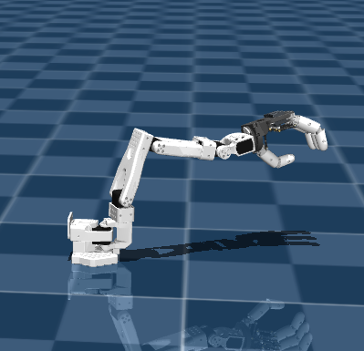
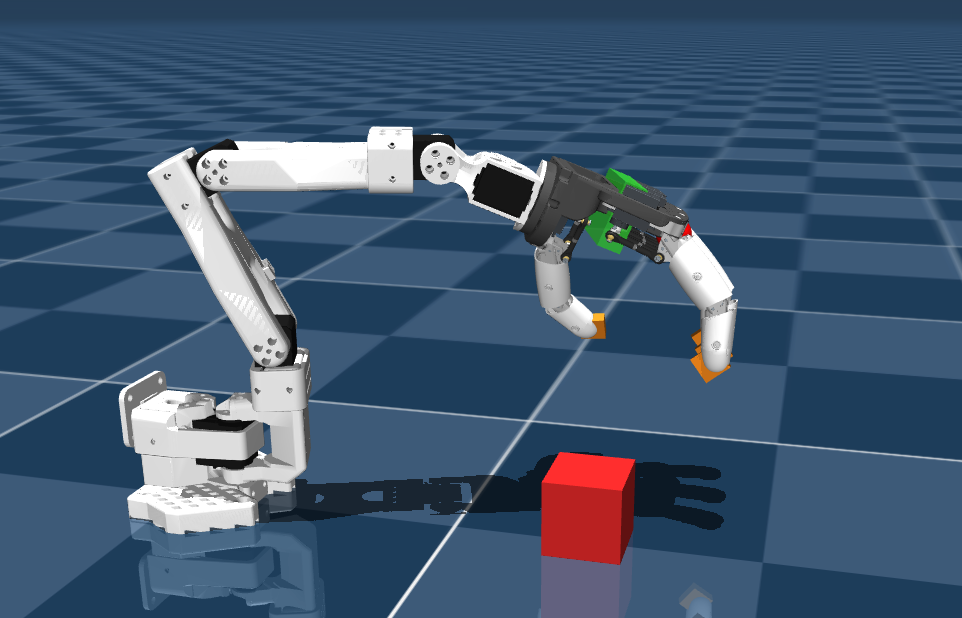

# Hand x Arm (SO-100 + Amazing Hand)

An open-source MuJoCo model combining the SO-100 robotic arm with the Amazing Hand dexterous hand.  
Provides a unified XML file and assets for easy simulation and development.  
Suitable for manipulation, grasping, control, and reinforcement learning research.  
Designed for integration with MuJoCo-based robotics frameworks and workflows.  


<p align="center">
  
  
</p>

<p align="center">
  <em> Arm + Hand movement &nbsp;&nbsp;&nbsp;|&nbsp;&nbsp;&nbsp; Pick-and-place demo</em>
</p>


---


## Project structure

- `so+hands/` → combined MuJoCo model and scene files
- `simu.py` → open the MuJoCo scene quickly
- `movement.py` → simple scripted arm + hand motion
- `pick_block.py` → basic pick/block grasp sequence demo
- `servo.py` → basic serial servo control test (hardware)

---

## Requirements

- Python 3.10+
- MuJoCo (`mujoco`)

### Setup (using uv)

**uv** is a fast Python package manager. Install it first:

```bash
curl -LsSf https://astral.sh/uv/install.sh | sh
```

Then sync dependencies:

```bash
uv sync
```

### Setup (using pip)

Alternatively, use pip:

```bash
pip install mujoco
```

---

## How to use

### With uv (recommended)

**1) Run simple simulation viewer**

```bash
uv run simu.py
```

and similarly for other files

### With Python (pip)

If you used pip to install dependencies, run scripts directly:

```bash
python simu.py
python movement.py
python pick_block.py

```

---

## Reference links

- SO-100: https://github.com/TheRobotStudio/SO-ARM100
- Amazing Hand: https://github.com/pollen-robotics/AmazingHand

---

## Notes

- Current scripts are basic demos intended for quick testing.
- You can tune grasp/motion behavior in `pick_block.py`.
- Main MuJoCo scenes are in `so+hands/scene.xml` and `so+hands/scene1.xml`.
